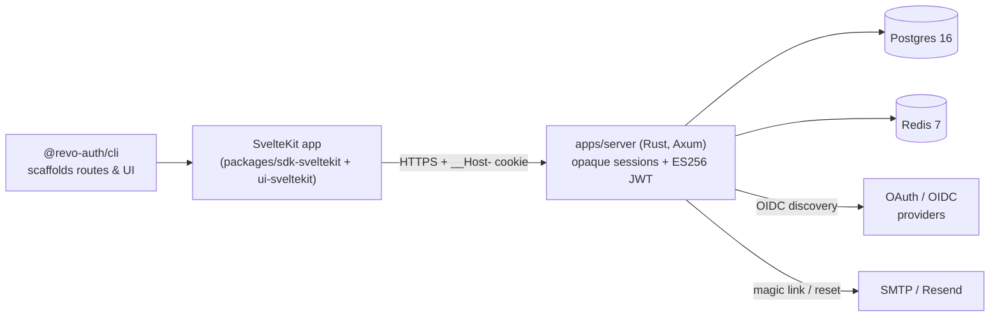

# Revo-Auth

> A batteries-included, production-grade authentication platform for the Svelte 5 era:
> Rust auth server, TypeScript SDKs, SvelteKit adapter, UI components, and a CLI that
> scaffolds code you **own** in your repo.

<!-- logo placeholder: assets/logo.svg -->

[](https://github.com/revo-auth/revo-auth/actions/workflows/ci.yml)
[](https://github.com/revo-auth/revo-auth/actions/workflows/security.yml)
[](./LICENSE)

Revo-Auth is built to the contract in
[`revo-auth-nuclear-prompt.md`](./revo-auth-nuclear-prompt.md): a multi-tenant auth
server with opaque sessions and ES256 service JWTs, CLI-scaffolded SvelteKit
integration (you own the routes and UI), PE7 design tokens, and a distroless deploy
target.

## Architecture



## Quickstart

```bash
# 1. Scaffold a SvelteKit app with routes, actions, and PE7 UI
pnpm dlx @revo-auth/cli init my-app

# 2. Bring the auth server up (distroless image, migrations auto-run)
docker run --rm -p 8080:8080 --env-file apps/server/.env \
  ghcr.io/revo-auth/revo-auth-server:latest

# 3. Start the app
cd my-app && pnpm dev
```

Full setup, key generation, and Fly.io deploy instructions live in
[`apps/server/README.md`](./apps/server/README.md).

## Feature matrix

Comparison with [BetterAuth](https://www.better-auth.com/) for orientation only - they
are adjacent projects with different trade-offs. Legend: checked = shipped,
warning = partial/behind flag, cross = not available.

| Capability | Revo-Auth | BetterAuth |
| --- | :---: | :---: |
| Svelte 5 runes idiomatic SDK | checked | warning |
| CLI scaffolds code you own in-repo | checked | cross |
| PE7 CSS design tokens for UI primitives | checked | cross |
| Multi-tenant apps (`X-Revo-App-Id`) | checked | warning |
| OAuth / OIDC (Google, GitHub, custom) | checked | checked |
| WebAuthn / passkeys | checked | checked |
| TOTP (RFC 6238) | checked | checked |
| Magic links | checked | checked |
| Organisations + RBAC | checked | checked |
| Audit log | checked | warning |
| Opaque sessions + ES256 service JWTs | checked | warning |
| Distroless Docker image (< 60MB) | checked | cross |
| Fly.io-ready (`apps/server/fly.toml`) | checked | cross |
| Server implementation language | Rust | TypeScript |

## Packages

| Package | Description |
| --- | --- |
| `apps/server` | Rust (Axum) auth server with Postgres + Redis, the single source of truth. |
| `apps/docs` | Starlight documentation site (deployed via `release.yml`). |
| `packages/sdk-core` | Framework-agnostic client SDK (fetch + types). |
| `packages/sdk-sveltekit` | SvelteKit actions, hooks, and load helpers. |
| `packages/ui-sveltekit` | Svelte 5 UI primitives with PE7 CSS tokens. |
| `packages/cli` | `@revo-auth/cli` - scaffolds routes, UI, and env into your repo. |
| `examples/sveltekit-demo` | Reference app used by Playwright in CI. |

### Scaffold a new app

```bash
pnpm dlx @revo-auth/cli init
```

The CLI writes auth routes, UI components, and environment hints directly into your
repo - you review, edit, and commit them like any other code. No magic runtime glue.

## Documentation

- Architecture and roadmap: [`revo-auth-nuclear-prompt.md`](./revo-auth-nuclear-prompt.md)
- Contributing: [`CONTRIBUTING.md`](./CONTRIBUTING.md)
- Security policy: [`SECURITY.md`](./SECURITY.md)
- Hosted docs: `https://revo-auth.dev/docs` (built from `apps/docs`).

## License

[MIT](./LICENSE) (C) Revo-Auth contributors.
